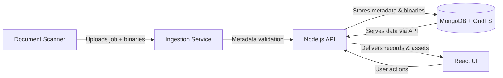

# System Diagram

The diagram illustrates the flow from scanner ingestion through the Node.js API into MongoDB (using GridFS for binary storage) and exposes the content to the React-based user interface.
